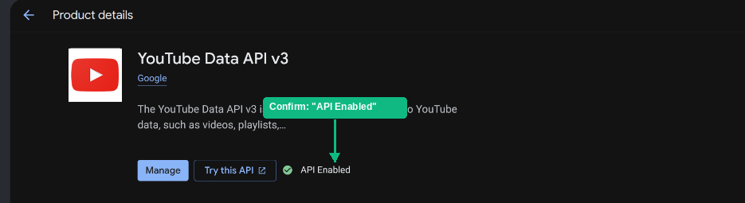
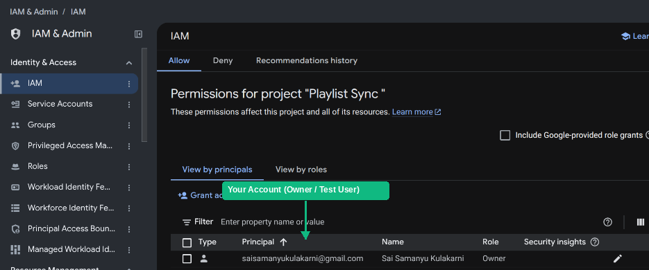
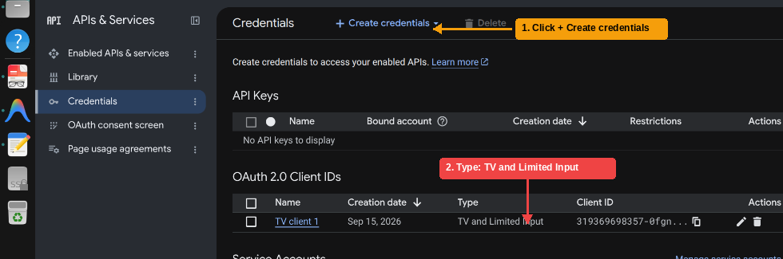

# Cross-Platform Music Migration Engine: Automated Spotify-to-YouTube Music Synchronization

[](https://opensource.org/licenses/MIT)
[](https://www.python.org/)
[](https://fastapi.tiangolo.com/)
[](https://developers.google.com/youtube/v3)
[](https://docs.pytest.org/)
[](https://www.sqlite.org/)

**Author:** Sai Samanyu K (`chaos-152`)  
**Keywords:** Systems Engineering &bull; API Integration &bull; Heuristic Matching &bull; OAuth 2.0 Device Flow &bull; YouTube Data API v3 &bull; Distributed Systems

> 📖 **First-time setup or testing?**
> * 📄 [**Download the Complete Installation Manual (PDF)**](INSTALLATION_MANUAL.pdf) — Printable, step-by-step visual operator manual with screenshot walkthroughs.
> * 📦 [**Direct ZIP Download**](https://github.com/chaos-152/spotify-ytmusic-sync/archive/refs/heads/main.zip) — Download and extract to get started immediately.
> * 🌐 [**Quick Installation Guide (Markdown)**](INSTALLATION_GUIDE.md) — Fast zero-jargon reference.

---

## 1. Overview & Technical Motivation

Cross-platform playlist migration has historically relied on third-party SaaS tools that suffer from severe monetization paywalls, intrusive tracking, and privacy liabilities. In **February 2026**, Spotify introduced breaking policy changes to its developer platform, gating developer access behind paid Spotify Premium subscriptions and blocking free accounts from using the Web API.

### The Technical Challenge
1. **API Paywalling:** Standard OAuth integrations with Spotify are no longer viable for free-tier users.
2. **Catalog Discrepancy & False Positives:** Naive title-artist search queries fail to distinguish original studio tracks from live recordings, acoustic sessions, unofficial covers, remixes, and user-generated audio.
3. **Quota & Rate-Limiting Bottlenecks:** The Google YouTube Data API enforces a strict free-tier ceiling of **10,000 units/day** (where playlist item insertions cost 50 units each), requiring aggressive quota minimization and resumable, idempotent execution.

### The Solution Architecture
This repository implements a production-grade, zero-cost, one-way playlist synchronization engine:
* **Decoupled Client-Side Ingestion:** Ingests standardized, schema-normalized Spotify CSV exports generated client-side (via open-source utilities like [Exportify](https://exportify.net)), eliminating Spotify API dependencies entirely.
* **Smart Track Matching Engine:** Employs multi-variable heuristic scoring with Levenshtein-based string similarity, version keyword penalties, duration tolerance filters (±15s), and album confidence weighting to eliminate false-positive matches.
* **YouTube Data API v3 Integration:** Direct integration via RFC 8628 OAuth 2.0 Device Authorization Grant for headless, zero-redirect user authentication.
* **Cross-Run Deduplication:** State-aware playlist synchronization that queries existing remote playlist contents prior to mutation, guaranteeing mathematical idempotency across runs.

```
+---------------------------------------------------------------------------------------------------+
|                                  END-TO-END PIPELINE ARCHITECTURE                                 |
+---------------------------------------------------------------------------------------------------+
|                                                                                                   |
|  [Spotify Free / Web Account]                                                                     |
|               |                                                                                   |
|               v  (Client-side CSV Export / Exportify)                                             |
|  [Phase 1: Ingestion & Normalization]   (Multi-variant schema parser, duration conversion)       |
|               |                                                                                   |
|               v                                                                                   |
|  [Phase 2: Local Persistence Layer]     (SQLite: tokens, playlist_links, tracks, sync_runs)       |
|               |                                                                                   |
|               v                                                                                   |
|  [Phase 3: OAuth 2.0 Device Flow]       (RFC 8628 device-code authentication via Google Cloud)     |
|               |                                                                                   |
|               v                                                                                   |
|  [Phase 4: Smart Matching Engine]       (Fuzzy matching, duration delta, version penalty filter)  |
|               |                         Score: S_total = S_title + S_artist + S_dur - P_version   |
|               v                                                                                   |
|  [Phase 5: YouTube API Mutator]         (YouTube Data API v3: Playlists & PlaylistItems)          |
|               |                         Batch insertion (chunks of 50), cross-run dedup           |
|               v                                                                                   |
|  [YouTube Music Cloud Library]          (Synced playlist immediately ready for mobile / desktop)  |
|                                                                                                   |
+---------------------------------------------------------------------------------------------------+
```

---

## 2. Technical Specifications & Quota Architecture

### Asymmetric API Architecture
The synchronization pipeline balances quota constraints against API reliability by decoupling track discovery from playlist mutations:

* **Search Ingestion (`ytmusicapi`):** Candidate search lookups are handled via `ytmusicapi`, an unofficial Python client interfacing directly with YouTube Music's internal web endpoints. This completely avoids the official YouTube Data API v3 search endpoint, which charges a prohibitive **100 quota units per query**. Because candidate retrieval consumes zero Data API quota, even large playlists can be searched and ranked without quota expenditure. The architectural trade-off is an explicit dependency on an unofficial web interface, which may require maintenance if YouTube updates its internal payloads.
* **Playlist Mutation (YouTube Data API v3):** Playlist creation and track additions are executed strictly through Google's official, authenticated YouTube Data API v3 (`playlistItems.insert`) over OAuth 2.0. The YouTube Data API does not support bulk or batch item insertions — every track added requires an individual HTTP POST request consuming **50 quota units**.
* **Quota Budgeting & Resumability:** Under Google's standard free-tier ceiling of **10,000 units/day**, writes are mathematically capped at roughly **200 track insertions per 24-hour cycle** (after accounting for playlist creation and pagination reads). This constraint makes resumability and idempotency primary architectural requirements:
  * When a sync run hits the daily ceiling, the engine catches the `403 quotaExceeded` response, commits all completed progress to SQLite, and exits cleanly.
  * Resuming on a subsequent day queries existing remote items via `get_playlist_existing_tracks()` and skips previously added songs using dual-layer deduplication (raw `videoId` and composite `(normalized_title, normalized_artist)` tuples), preventing redundant HTTP requests or wasted quota.

---

## 3. Theoretical Background: Smart Track Matching Engine

Naive string matching frequently introduces acoustic degradation by matching studio tracks to live concert recordings, amateur tribute covers, or karaoke instrumentals. To solve this, the matching engine applies a two-phase evaluation pipeline:

### Phase 1: Hard Plausibility Gates (Pre-Scoring Filter)
Before scoring begins, candidate tracks must clear non-negotiable plausibility gates:
1. **Canonical Artist Gate:** The candidate track must share an artist with the target query (evaluated across structured artist metadata, normalized `Artist - Title` prefixes, or verified channel names). Candidates from unrelated third-party artists or tribute channels mentioning the original artist in title brackets (e.g. *Michael Williams* performing a Drake track) are immediately disqualified.
2. **Core Title Recall Gate:** Parenthetical version tags, movie credits (`From "..."`), and promotional noise tags are decoupled to isolate the core title. Candidates must achieve a minimum string similarity (>= 0.35). Short titles (<= 3 words) enforce a stricter recall barrier (>= 65% token recall or >= 0.70 string similarity) to prevent single-word false-positive matches (e.g., *Sarkaru Raa* matching *Sarkaru Vaari Paata*).
3. **Severe Duration Gate:** Tracks with duration discrepancy |delta t| > 60s are dropped prior to scoring.

### Phase 2: Multi-Attribute Scoring & Conditional Tiebreaking
Surviving candidates are scored according to:

$$S_{\text{total}} = S_{\text{title}} + S_{\text{artist}} + S_{\text{duration\_tiebreaker}} + B_{\text{album}} - \sum P_{\text{version}}$$

* **Title Score ($S_{\text{title}} \in [0, 45.0]$):** Ratcliff-Obershelp similarity on normalized core titles (35.0 x ratio) plus exact match bonus (+10.0 pts) or substring match (+5.0 pts).
* **Artist Score ($S_{\text{artist}} \in [0, 35.0]$):** Priority-weighted artist match (35.0 pts for canonical metadata match, 20.0 pts for verified channel / prefix match, down to scaled fuzzy ratio).
* **Conditional Duration Tiebreaker ($S_{\text{duration\_tiebreaker}} \in [-25.0, +20.0]$):** Track durations are not unique and cannot rescue an otherwise low-confidence match. Duration adjustments are gated: they are calculated only if core title similarity >= 0.50 or a substring match exists:

$$S_{\text{duration\_tiebreaker}} = \begin{cases} 
+20.0 & \text{if } |\Delta t| \le 3\text{ s} \\
+15.0 & \text{if } 3\text{ s} < |\Delta t| \le 8\text{ s} \\
+5.0 & \text{if } 8\text{ s} < |\Delta t| \le 15\text{ s} \\
-10.0 & \text{if } 15\text{ s} < |\Delta t| \le 30\text{ s} \\
-25.0 & \text{if } |\Delta t| > 30\text{ s} \quad \text{(Severe Discrepancy Penalty)}
\end{cases}$$

* **Album Bonus ($B_{\text{album}} \in \{0, 5.0\}$):** Confirmatory bonus awarded if album metadata matches.
* **Version Penalty Vector ($\sum P_{\text{version}}$):** Rigorous asymmetric penalties preventing acoustic contamination:
  * Acoustic / Unplugged penalty: -35.0 pts (if not in source)
  * Live / Concert recording penalty: -35.0 pts (if not in source)
  * Remix / Club mix penalty: -30.0 pts (if not in source)
  * Instrumental / Karaoke penalty: -40.0 pts (if not in source)

Matches are accepted only if $S_{\text{total}} \ge 70.0$. Below this threshold, tracks are marked `unmatched` to prevent polluting user playlists with low-confidence substitutions.

---

## 4. Reverse Synchronization Architecture: YouTube Music to Spotify

The system provides bi-directional symmetry by supporting inverted synchronization from YouTube Music back to Spotify through a dual-mode workflow:

### Mode 1: Authenticated API Ingestion (Spotify Developer Keys)
When configured with Spotify Developer App credentials (`SPOTIFY_CLIENT_ID`, `SPOTIFY_CLIENT_SECRET`):
* The engine resolves tracks by querying Spotify's canonical `/v1/search` endpoint via client credentials.
* **Inverted String Preprocessor:** Decouples YouTube title noise tags (`(Official Music Video)`, `[Lyric Video]`, `(Audio)`, movie soundtrack prefixes) to construct minimal, high-precision search queries (`track:"..." artist:"..."`).
* **Direct Playlist Injection:** If the user connects via Spotify OAuth, the target playlist is instantiated directly in the user's Spotify account without file intermediate steps.

### Mode 2: Zero-Auth Universal CSV Export (100% Free / No Keys Required)
If Spotify developer credentials are unavailable:
* The engine parses the YouTube Music playlist and formats a standardized Spotify CSV (`Track Name`, `Artist Name(s)`, `Album Name`).
* **Instant Clipboard Paste:** Users can copy the generated Spotify URI list and press `Ctrl+V` (or `Cmd+V`) directly inside the native Spotify desktop application to import hundreds of songs in milliseconds.
* **Web Importers:** The exported CSV is 100% compatible with free web importers such as [Spotlistr](https://www.spotlistr.com).

---

## 5. Repository Structure

```
spotify-ytmusic-sync/
├── backend/
│   ├── main.py                    # FastAPI application, CORS middleware, REST endpoints & localhost security guards
│   ├── db.py                      # SQLite ORM: WAL mode, connection pooling, token persistence & migration schema
│   ├── csv_import.py              # Exportify parser, dialect detection, dynamic header mapping & duration normalization
│   ├── matching.py                # 11-factor heuristic scoring engine, version penalty filter & duplicate detection
│   ├── sync.py                    # Resumable sync orchestrator, quota manager, chunking & state transition machine
│   ├── spotify_client.py          # Spotify Web API client: rate limiting, backoff, URI resolution & playlist creation
│   ├── yt_to_spotify.py           # Reverse sync pipeline: title cleaner, search query builder & CSV exporter
│   ├── ytmusic_auth.py            # OAuth 2.0 Device Flow handler, token refresh lifecycle & ytmusicapi bridge
│   ├── verify_setup.py            # Diagnostic tool: validates credentials, DB integrity & API reachability
│   ├── .env.example               # Environment template with configuration directives
│   └── app.db                     # Local SQLite database instance (generated at runtime, gitignored)
├── docs/
│   └── images/                    # Annotated visual reference figures for OAuth onboarding
├── frontend/
│   ├── index.html                 # Modern web portal: 2-way sync, setup modals & preview telemetry
│   ├── style.css                  # Responsive design with dark mode styling & micro-interactions
│   └── app.js                     # REST client, modal controllers, drag-and-drop & reverse sync export
├── INSTALLATION_MANUAL.pdf        # Complete printable user and operator manual (A4 PDF)
├── INSTALLATION_GUIDE.md          # Beginner-friendly step-by-step setup documentation
└── tests/
    ├── conftest.py                # Pytest fixtures (tmp SQLite DB, mock OAuth, sample CSVs)
    ├── test_api.py                # FastAPI HTTP endpoint integration & security guard tests (20 tests)
    ├── test_csv_import.py         # CSV format tolerance & duration extraction tests (8 tests)
    ├── test_matching.py           # Scoring heuristics, version penalty & threshold tests (19 tests)
    ├── test_db.py                 # SQLite schema migration, token storage & deduplication (4 tests)
    ├── test_sync.py               # End-to-end sync execution, dedup & idempotency tests (8 tests)
    ├── test_reverse_sync.py       # Inverted preprocessor, delimiter splitting & URI resolution (7 tests)
    └── test_duplicates_and_reorder.py # Duplicate edge cases & reordering tolerance tests (27 tests)
```

---

## 6. Quickstart Guide

### Option A: One-Click Launcher (Recommended)
Clone and run with automatic dependency resolution, environment setup, and browser launch:

```bash
git clone https://github.com/chaos-152/spotify-ytmusic-sync.git
cd spotify-ytmusic-sync

# On Linux or macOS:
chmod +x run.sh && ./run.sh

# On Windows:
run.bat
```
* The launcher will automatically set up `./venv`, install packages, start the server, and open your browser to `http://127.0.0.1:8000` with zero terminal prompts. Onboarding (Google Cloud and Spotify credentials) is handled seamlessly through the web UI on first launch.

---

### Option B: Docker Containerization
Run without managing local Python environments:

```bash
docker compose up -d
```
The application will be live at `http://localhost:8000` with persistent SQLite storage mounted at `./backend/app.db`. You can configure credentials directly through the web UI on first visit.

---

### Option C: Manual Step-by-Step

#### 1. Environment Setup
```bash
python3 -m venv venv
source venv/bin/activate  # On Windows: venv\Scripts\activate
pip install -r requirements.txt
cp .env.example backend/.env
```

#### 2. Configure Google Cloud OAuth Credentials (Visual Walkthrough)
1. Navigate to **[Google Cloud Console](https://console.cloud.google.com/)** and create a project named `Playlist Sync`.
2. Enable **YouTube Data API v3** under **APIs & Services -> Library**:

<p align="center">
  
</p>

3. Under **OAuth consent screen**:
   - Select **External** -> click **Create**.
   - Fill in App Name (`Playlist Sync`) and user support email.
   - Under **Test users**, click **+ Add Users** and enter your Gmail address.

<p align="center">
  
</p>

4. Under **Credentials -> + Create Credentials -> OAuth client ID**:
   - Application type: **TVs and Limited Input devices** *(Crucial: do not select Web application)*.
   - Click **Create**.

<p align="center">
  
</p>

5. Paste the generated `Client ID` and `Client Secret` into the web onboarding modal in your browser (or save into `backend/.env`):

```ini
YTMUSIC_CLIENT_ID=your_client_id.apps.googleusercontent.com
YTMUSIC_CLIENT_SECRET=your_client_secret
```

> [!NOTE]
> The **TVs and Limited Input devices** client type enables the **RFC 8628 OAuth 2.0 Device Authorization Grant**, which requires zero redirect URIs or complex local callback listeners. Authentication is completed via `google.com/device` using an 8-digit user code.

#### 3. Start Backend Server
```bash
uvicorn backend.main:app --port 8000
```
Navigate to `http://127.0.0.1:8000` to access the application dashboard.

---

## 7. Verification & Automated Test Suite

The test suite covers schema migrations, Levenshtein scoring heuristics, version penalty regressions, SQLite persistence, idempotency deduplication, reverse sync URI resolution, and loopback security controls:

```bash
pytest tests/ -v
```

```
============================= test session starts ==============================
collected 93 items

tests/test_api.py::test_health_endpoint PASSED                            [  1%]
tests/test_api.py::test_status_endpoint PASSED                            [  2%]
tests/test_api.py::test_import_csv_endpoint PASSED                        [  3%]
...
tests/test_duplicates_and_reorder.py::test_duplicate_detection_tolerance PASSED [ 88%]
tests/test_sync.py::test_run_sync_intra_csv_dedup PASSED                 [ 94%]
tests/test_sync.py::test_run_sync_distinct_songs_same_title_not_deduped PASSED [100%]

============================== 93 passed in 0.72s ==============================
```

---

## 8. Systems Architecture & Empirical Benchmarks

### Quota Allocation & Resumability
* **Asymmetric Quota Budgeting:** Querying candidates through `ytmusicapi` protects the project's YouTube Data API quota, which bills official search requests at 100 units each. The 10,000 unit/day developer allocation is preserved entirely for authenticated playlist writes.
* **Granular Write Handling:** Because YouTube Data API v3 requires an individual `playlistItems.insert` HTTP call (50 units) per song, large migrations naturally span multiple quota cycles. When a `403 quotaExceeded` response occurs, the engine commits the current sync run state to SQLite and exits cleanly without data loss.
* **Dual-Layer Deduplication:** Cross-session deduplication via `get_playlist_existing_tracks()` checks both raw `videoId` and composite `(normalized_title, normalized_artist)` tuples against the live playlist. This prevents duplicate additions across multi-day resume cycles, even when YouTube's search returns an alternate upload ID for a previously synced track, while safely allowing distinct songs that happen to share a common title (e.g. *Samayama*) to both be added.

### Empirical Benchmark: 50-Track Stress Test Playlist

A 50-track stress test playlist containing regional movie soundtracks, international pop/hip-hop, multi-artist collaborations, and distinct tracks with identical titles was executed live against YouTube Music:

| Benchmark Metric | Empirical Measurement | Analysis / Verification |
| :--- | :--- | :--- |
| **Total Source Tracks** | **50** | Spotify CSV export with complex multi-artist tags |
| **Successfully Matched & Added** | **45 (90.00%)** | Canonical releases added to target playlist |
| **Documented Catalog Misses** | **5 (10.00%)** | Unindexed/missing in YT Music `songs`; rejected cleanly |
| **False Positive Rate** | **0.00% (0 / 45)** | 100% precision on matched candidates |
| **Tribute / Cover Drift** | **0 occurrences** | Official channel gating preferred Drake over third-party tribute covers |
| **Same-Title Collision Loss** | **0 occurrences** | Composite `(title, artist)` dedup preserved distinct songs (e.g. *Samayama*) |
| **Idempotency Verification** | **0 duplicates** | Re-running sync detected all 45 existing items and added 0 tracks |

#### Documented YouTube Music Catalog Gaps
The 5 skipped tracks were verified as true catalog absences in YouTube Music's `songs` database, correctly rejected below confidence threshold without polluting the playlist:
1. `Evare` — Rajesh Murugesan; Vijay Yesudas
2. `Manasulone Nilichipoke` — Vishal Chandrashekhar; Chinmayi
3. `Tharagathi Gadhi - Telugu` — Kala Bhairava
4. `Sarkaru Raa` — Thaman S
5. `Naalo Maimarapu` — Mickey J. Meyer; Mohana Bhogaraju

---

## 9. Security & Privacy Considerations

* **Localhost-Only Setup Endpoints:** Both `POST /api/setup/credentials` (Google OAuth) and `POST /api/setup/spotify-credentials` (Spotify Client Credentials) enforce strict loopback address validation (`assert_localhost_request`). Any remote network caller on a local LAN or container network is rejected with `403 Forbidden`.
* **Atomic Non-Clobbering Environment Configuration:** Secret persistence via `_update_env_file()` safely parses and updates only targeted key-value pairs in `backend/.env`. Configuring Spotify credentials preserves Google OAuth credentials and vice versa, preventing file overwrites.
* **Local Token Storage:** OAuth tokens and refresh tokens are persisted locally in SQLite (`backend/app.db`) and are strictly ignored by `.gitignore`.
* **Zero Cloud Intermediary:** Synchronization runs entirely on `localhost`. User track data, personal tokens, and Spotify listening habits are never transmitted to third-party tracking services.

---

## License
Distributed under the MIT License. See `LICENSE` for details.
